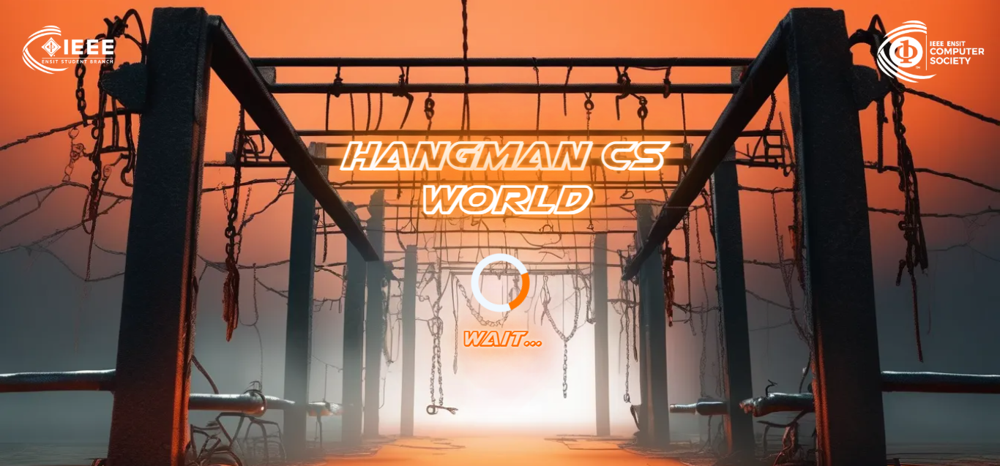
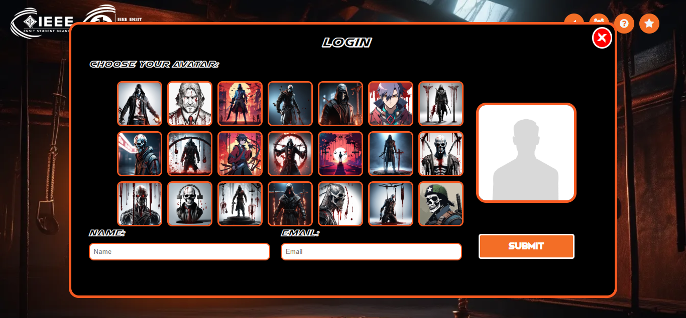
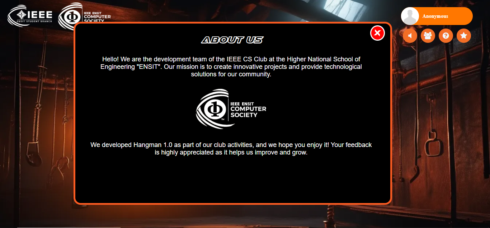
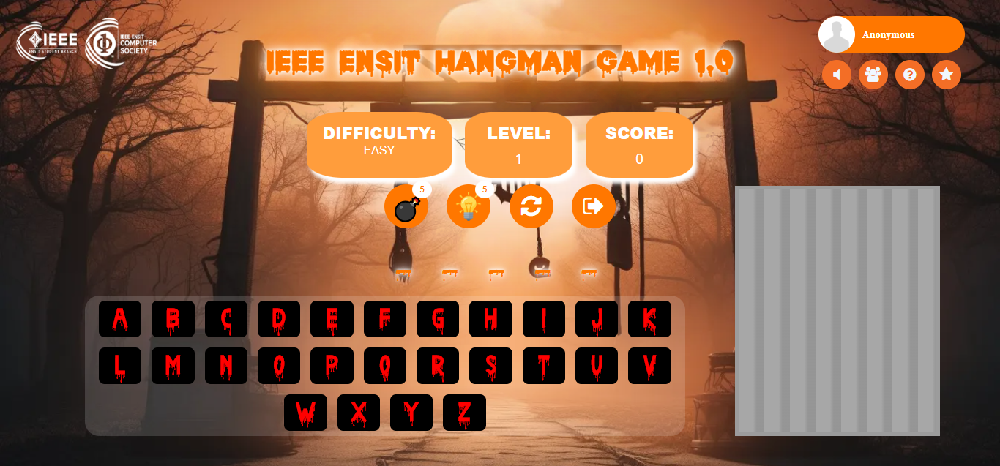
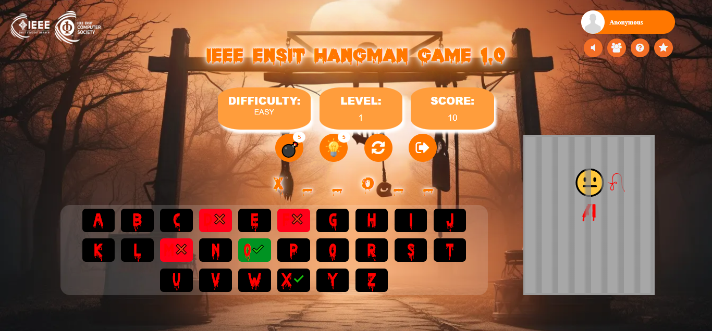
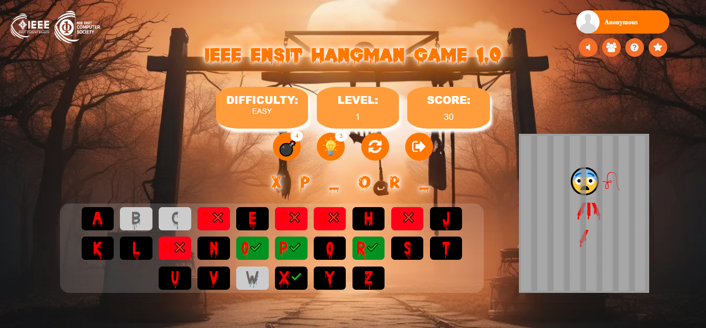
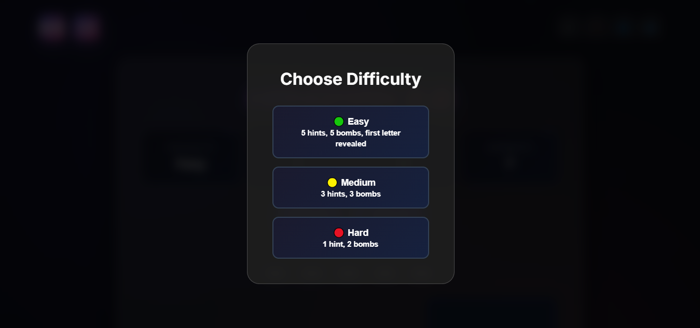
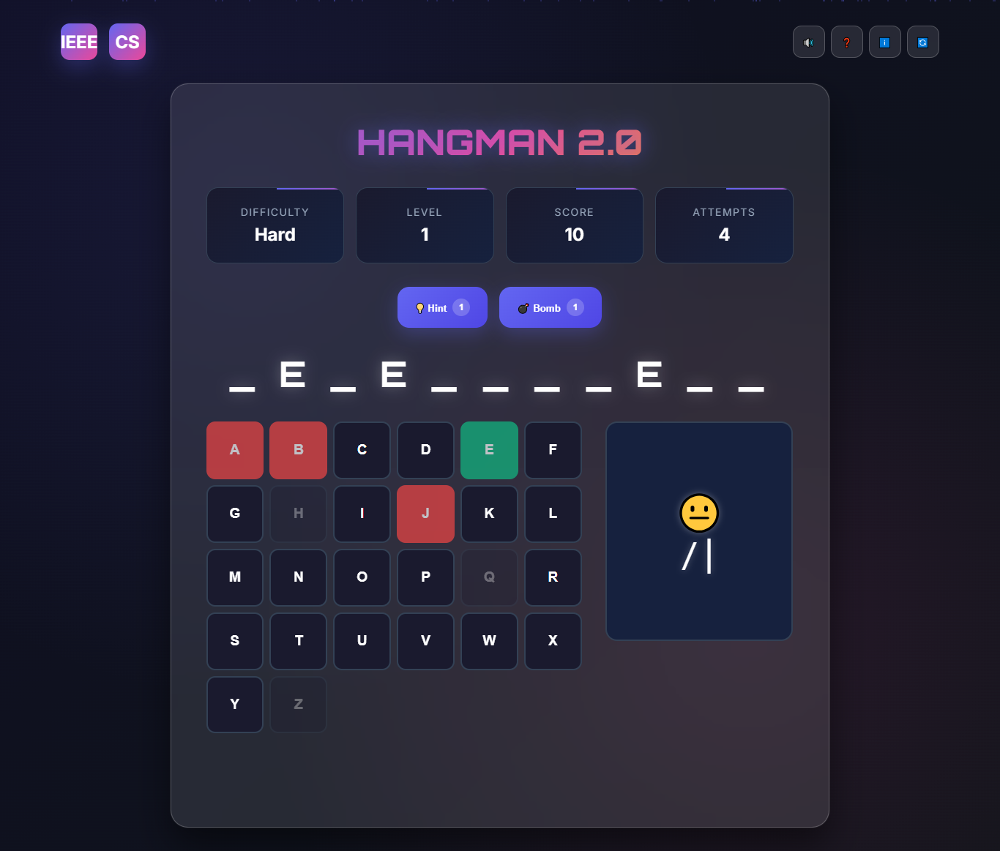

# Hangman Game – Versions 1.0 & 2.0 

Two modern web-based Hangman game versions:  
- **1.0**: A classic but enhanced edition with hints, bombs, and user profiles.  
- **2.0**: A redesigned version featuring modern visuals, animations, and advanced gameplay.  

---

## 🔹 Version 1.0

A classic web-based Hangman game that revives the traditional word-guessing experience with multiple difficulty levels, hints, bombs, and an interactive score system.

<table>
<tr>
<td></td>
<td></td>
</tr>
<tr>
<td></td>
<td></td>
</tr>
<tr>
<td></td>
<td></td>
</tr>
</table>

---

## 🔷 Version 2.0

A modern, interactive Hangman game with stunning visuals and advanced features, developed by the IEEE Computer Society Club at ENSIT.  

<table>
<tr>
<td></td>
<td></td>
</tr>
</table>

### Modern Design Improvements
- Glassmorphism UI (blur & transparency)  
- Animated particle background  
- Dynamic gradients & smooth transitions  
- Dark theme with vibrant accents  

---

## 🎮 Gameplay Features (Both Versions)

- **Three difficulty levels**: Easy, Medium, Hard  
- **Hints**: Reveal random letters  
- **Bombs**: Remove incorrect letters  
- **Score tracking** with progressive levels  
- **Audio feedback** (music & SFX)  
- **Keyboard support** (desktop)  
- **Responsive design** (desktop, tablet, mobile)  
- **User profiles** (login & avatar selection, v1.0)  

---

## ⚙️ Technical Features

- **Frontend**: HTML5, CSS3, JavaScript  
- **Libraries**: jQuery (v1.0 only)  
- **Animations**: CSS keyframes & modern transitions  
- **Audio**: Web Audio API for music & effects  
- **Design**: Responsive layouts optimized for performance  

---

## 🎯 How to Play

1. Choose a difficulty level: Easy, Medium, or Hard.  
2. Guess letters using the on-screen keyboard or your physical keyboard.  
3. Avoid wrong guesses – each mistake adds to the hangman drawing.  
4. Complete the word before the drawing is finished to win.  
5. Use **💡 Hints** and **💣 Bombs** strategically.  

### Difficulty Levels

| Level     | Hints | Bombs | Special Features      |
| --------- | ----: | ----: | --------------------- |
| 🟢 Easy   |     5 |     5 | First letter revealed |
| 🟡 Medium |     3 |     3 | Standard gameplay     |
| 🔴 Hard   |     1 |     2 | Maximum challenge     |

### Scoring System

- **+10 points** per correct letter  
- **+10 points** per hint used  
- Progressive difficulty increases by level  
- Score resets on Game Over  

---

✨ *Enjoy the game and challenge yourself with this modern take on the timeless Hangman classic!*  
